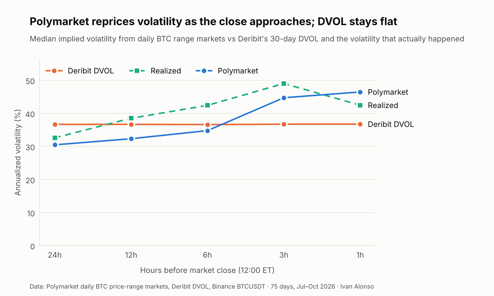
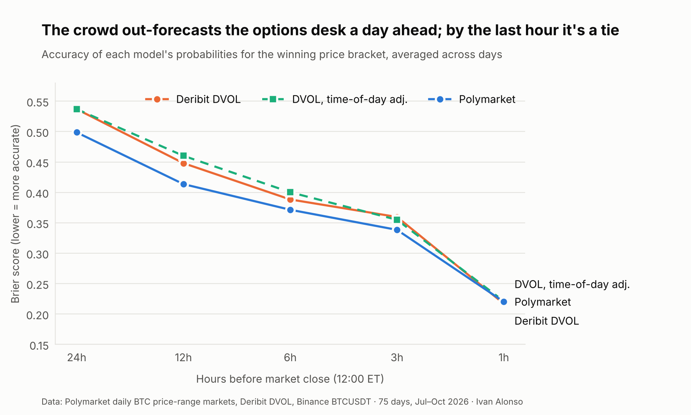

# Implied Odds

**Does Polymarket price Bitcoin volatility like Deribit?**

Polymarket runs a daily market on where Bitcoin will close: "Bitcoin price on October 6?", split into
$2,000 price brackets that each pay $1 if BTC lands inside. A set of bracket prices is a set of
digital options, so it implies a volatility forecast. This project extracts that forecast and
tests it against the professional benchmark, Deribit's DVOL index, over 75 days.

*Spanish introduction for non-specialists: [`docs/presentacion.md`](docs/presentacion.md).*

## Key findings

1. **A day ahead, the crowd forecasts better than the options desk.** At 24 h and 12 h before the
   close, Polymarket's bracket probabilities are significantly more accurate (Brier score, paired
   t > 2) than probabilities built from Deribit's DVOL, from DVOL adjusted for time of day, and
   from recent realized volatility.
2. **Polymarket's volatility has a term structure; DVOL is flat.** The crowd prices ~31% annualized
   volatility a day out and ~47% in the final hour, tracking the intraday pattern of BTC (the 12:00 ET
   close lands in the US session). DVOL stays near 37% because it is a 30-day measure.
3. **In the last hour it's a tie.** All models score the same (Brier 0.215–0.221).
4. **No measurable lag.** Minute-by-minute, Polymarket's prices track the fair value implied by the
   Binance spot price with no lag of one minute or more (62 of 79 days best fit at zero lag).
   Sub-minute latency, where trading bots operate, can't be measured with this data.





## Results

Mean Brier score for the full set of brackets (lower is better), 75 days, 14 Jul – 5 Oct 2026.
t = paired t-statistic of the difference vs Polymarket (t > 2: Polymarket significantly better).

| Hours to close | Polymarket | DVOL | t | DVOL, time-of-day adj. | t | Realized vol 7d, adj. | t |
|---|---|---|---|---|---|---|---|
| 24 | **0.499** | 0.537 | 2.76 | 0.537 | 2.76 | 0.524 | 2.30 |
| 12 | **0.414** | 0.448 | 3.09 | 0.460 | 3.05 | 0.440 | 2.05 |
| 6 | **0.371** | 0.388 | 1.45 | 0.400 | 1.83 | 0.398 | 2.33 |
| 3 | **0.338** | 0.360 | 1.87 | 0.355 | 1.19 | 0.358 | 1.81 |
| 1 | 0.220 | 0.217 | −0.30 | 0.221 | 0.06 | 0.215 | −0.36 |

## Method

1. **Data.** Daily BTC bracket markets from Polymarket's public APIs (bracket bounds, settlement and
   minute-level prices), Deribit's DVOL (hourly), and Binance BTCUSDT candles. Settlement rule:
   close of the Binance 1-minute candle at 12:00 ET. Our reconstruction matches Polymarket's official
   winner on 100% of days.
2. **Snapshots** at 24, 12, 6, 3 and 1 h before the close. A snapshot is used only if every bracket
   price is less than 3 minutes old.
3. **Implied volatility.** Bracket prices are normalized to sum to 1 (removing the ~1–2% overround),
   then a driftless lognormal centered on the Binance spot is fitted; the volatility that best
   reproduces the prices is Polymarket's implied volatility.
4. **Benchmarks**, all using only data available at the snapshot: raw DVOL; DVOL reweighted by the
   historical variance of each hour of the day; and 7-day realized volatility with the same
   adjustment.
5. **Scoring.** Brier score and log-loss over all brackets, compared day by day with a paired t-test.
6. **Lag test.** Polymarket prices at minute *t* vs fair bracket probabilities from spot at
   *t − k*, k = 0…10 minutes. Timestamps are aligned so that any bias favors Polymarket.

## Limitations

- **Sample:** 75 days in one volatility regime (DVOL 33–45). Results at 6 h and 3 h are directionally
  consistent but not significant against every benchmark.
- **Mid prices, not executable prices.** Historical prices are midpoints; the order book isn't
  archived, so trading profitability can't be tested from this data.
- **Model:** a lognormal centered on spot. A directional view by the crowd would be partly absorbed
  into the fitted volatility.
- **DVOL horizon:** DVOL is a 30-day index; Deribit's nearest-expiry options are the natural next
  benchmark (spot checks show their implied vol well below DVOL, e.g. 22.7% vs 36.3% on 6 Oct 2026).
- **Access:** Polymarket has been blocked in Spain since 27 May 2026 (Ministerio de Consumo,
  precautionary measure). This is a passive analysis of public data; no positions were taken.

## Correction log

- **6 Oct 2026.** The first version sampled Polymarket prices every 10 minutes, so each snapshot
  used prices ~10 minutes older than the spot price. That penalized Polymarket and produced a
  spurious "loss" in the final hour. With minute-level prices the loss disappears and the 24 h and
  12 h results become stronger.

## Reproduce

```bash
pip install -r requirements.txt
python src/fase1_descarga.py --start 2026-07-01 --end 2026-10-05   # download
python src/fase1_descarga.py --solo-precios                        # minute-level snapshot prices
python src/fase2_vol_implicita.py                                  # implied volatility
python src/fase3_benchmarks.py                                     # benchmarks and scores
python src/fase4_retraso.py                                        # lag test (downloads 1-min data)
python src/fase5_graficos.py                                       # figures
```

Downloaded data is written to `data/` and not versioned; the final result files
(`fase2_snapshots.csv`, `fase3_scores.csv`, `fase4_lag.csv`) are included so the figures can be
rebuilt without downloading anything (`python src/fase5_graficos.py`).

Full reports (PDF): [English](informe/Report_ImpliedOdds_Ivan_Alonso_EN.pdf) ·
[Español](informe/Informe_ImpliedOdds_Ivan_Alonso_ES.pdf)

## Author

Ivan Alonso · [GitHub](https://github.com/ivanalonso-dev) ·
[LinkedIn](https://linkedin.com/in/ivanalonsobcsentinel) · [X](https://x.com/IvanAlonsoBCSen)
